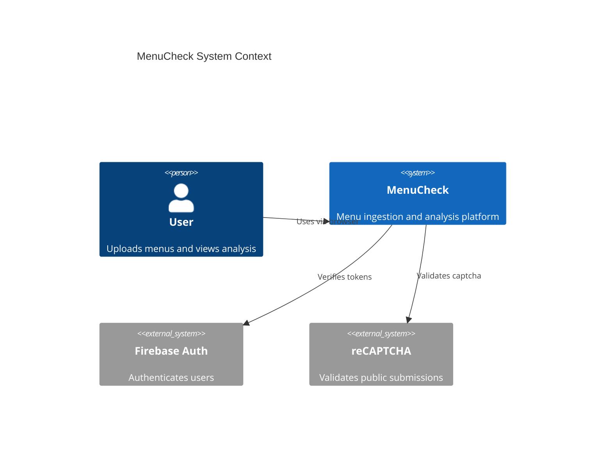
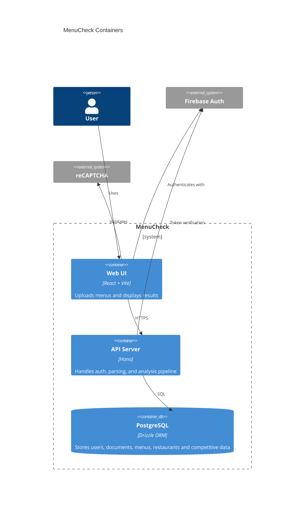
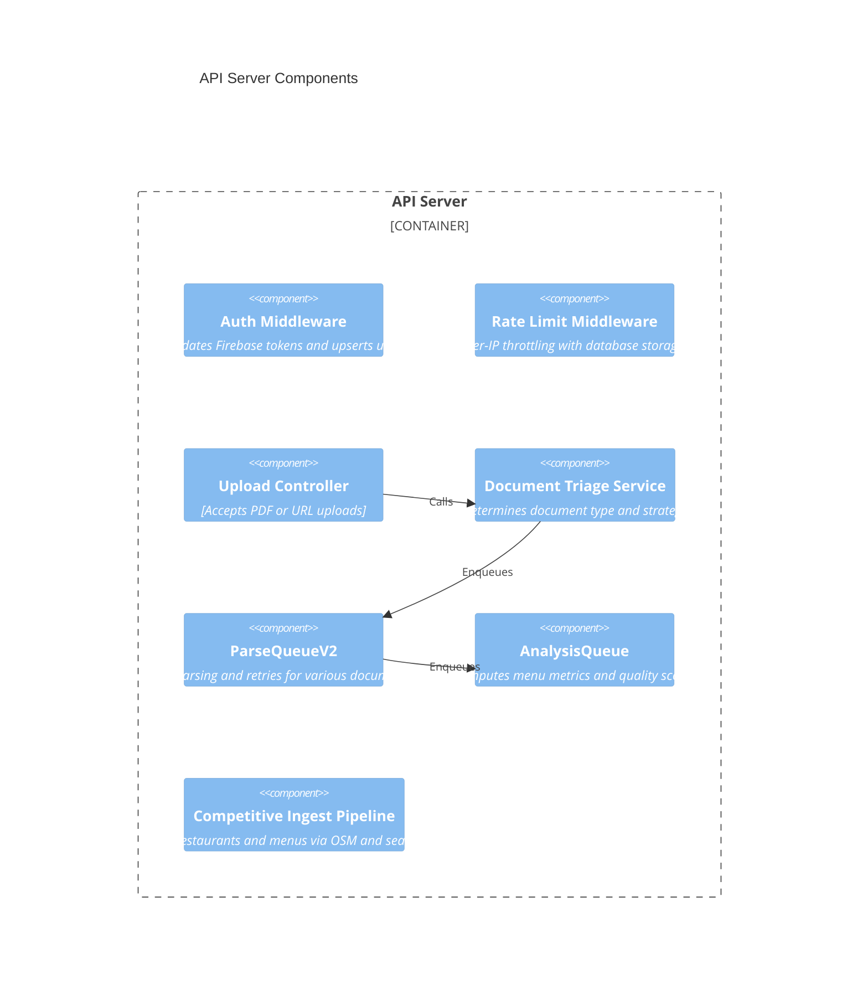

# C4 Model

This document describes the system using the [C4 model](https://c4model.com/).

## Context

```mermaid
C4Context
    title MenuCheck System Context
    Person(user, "User", "Uploads menus and views analysis")
    System(menucheck, "MenuCheck", "Menu ingestion and analysis platform")
    System_Ext(firebase, "Firebase Auth", "Authenticates users")
    System_Ext(recaptcha, "reCAPTCHA", "Validates public submissions")
    Rel(user, menucheck, "Uses via browser")
    Rel(menucheck, firebase, "Verifies tokens")
    Rel(menucheck, recaptcha, "Validates captcha")
```

## Containers

```mermaid
C4Container
    title MenuCheck Containers
    Person(user, "User")
    Boundary(menucheck, "MenuCheck") {
        Container(ui, "Web UI", "React + Vite", "Uploads menus and displays results")
        Container(api, "API Server", "Hono", "Handles auth, parsing, and analysis pipeline")
        ContainerDb(db, "PostgreSQL", "Drizzle ORM", "Stores users, documents, menus, restaurants and competitive data")
    }
    System_Ext(firebase, "Firebase Auth")
    System_Ext(recaptcha, "reCAPTCHA")
    Rel(user, ui, "Uses")
    Rel(ui, api, "HTTPS")
    Rel(api, db, "SQL")
    Rel(api, firebase, "Token verification")
    Rel(ui, firebase, "Authenticates with")
    Rel(ui, recaptcha, "Validates")
```

## API Server Components

```mermaid
C4Component
    title API Server Components
    Container_Boundary(api, "API Server") {
        Component(auth, "Auth Middleware", "Validates Firebase tokens and upserts users")
        Component(rate, "Rate Limit Middleware", "Per-IP throttling with database storage")
        Component(upload, "Upload Controller", "Accepts PDF or URL uploads")
        Component(triage, "Document Triage Service", "Determines document type and strategy")
        Component(parse, "ParseQueueV2", "Queued parsing and retries for various document types")
        Component(analysis, "AnalysisQueue", "Computes menu metrics and quality scores")
        Component(competitive, "Competitive Ingest Pipeline", "Discovers restaurants and menus via OSM and search engines")
    }
    Rel(upload, triage, "Calls")
    Rel(triage, parse, "Enqueues")
    Rel(parse, analysis, "Enqueues")
```
